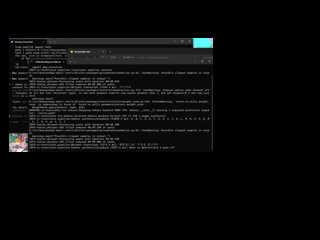

# Realtime Speech Translator (PREVIEW) (Windows)

> **⚠️ PREVIEW WARNING:** This project is an early preview build intended for evaluation only. Expect breaking changes, missing features, and instability; do **not** rely on it for production or mission-critical workflows.

READ ALL DOCUMENT FOR USE!

IF YOU WANT USE ONLY CUDA = run for_nvidia-gpu-run.bat 

and replace requirements.txt to requirements_nvidia.txt

and change to config
IN local.toml 

 

[app]

compute_mode = "cuda"

AND 

settings.toml

IN

[asr]
device = "cuda"
compute_type = "float16"

.......
AND

[kokoro]
backend = "pytorch"
device = "cuda"

## Overview
- Captures mono 16-bit PCM audio from the selected input device, segments speech with WebRTC VAD (plus optional forced segmentation), normalizes the audio, runs Faster-Whisper with filler removal and fallback translation, then synthesizes Kokoro 82M speech with optional voice conversion and multi-device playback.【F:src/audio_io.py†L10-L76】【F:src/vad.py†L19-L177】【F:src/preprocess.py†L192-L340】【F:src/asr.py†L29-L117】【F:src/pipeline.py†L331-L595】【F:src/tts_kokoro.py†L120-L366】
- Runtime state (language, preset, devices, latency) is coordinated by a background pipeline thread so the Tk UI can update labels, latency gauges, and device choices without blocking audio processing.【F:src/pipeline.py†L144-L695】【F:src/ui.py†L10-L195】

(CPU Whisper + KOKORO TTS/ LLM inferrence =CUDA)Click on the GIF to go to the YouTube video.

https://youtu.be/6kSL6WAV_mo   (CUDA Inference ONLY)
## Documentation
- [English technical overview](docs/overview.en.md)
- [한국어 문서](docs/overview.ko.md)
- [日本語ドキュメント](docs/overview.ja.md)

## Setup
### Requirements
- Windows 10/11 with Python 3.10+ available on `PATH`; the bootstrap script refuses to run if Python is missing or too old.【F:for_vene.bat†L4-L26】
- Install the dependencies listed in `requirements.txt` (Faster-Whisper, WebRTC VAD wheels, sounddevice, Kokoro runtimes, Edge/Piper TTS, PyTorch, etc.).【F:requirements.txt†L1-L21】

### Windows bootstrap script
Run `for_vene.bat` to create/update `.venv`, upgrade pip/setuptools/wheel, and install all requirements. Successful completion prints the commands needed to activate the environment later.【F:for_vene.bat†L11-L47】

### Manual installation outline
1. Create and activate a virtual environment (`python -m venv .venv` → `call .\.venv\Scripts\activate`).
2. `pip install --upgrade pip setuptools wheel`.
3. `pip install -r requirements.txt` (remove or edit the extra index if you want a CUDA/ROCm PyTorch build).【F:for_vene.bat†L22-L45】【F:requirements.txt†L1-L21】

### Optional tools
- Add ffmpeg to `PATH` so the preprocessor can use ffmpeg-based resampling and pydub can decode MP3 responses.【F:src/preprocess.py†L239-L295】
- Virtual audio cables (e.g., VB-CABLE) can be selected through the device picker dialogs to mirror Kokoro output to conferencing software.【F:src/main.py†L37-L188】【F:src/tts_kokoro.py†L428-L553】

## Running
1. Activate the virtual environment and start the UI with `python -m src.main`, or run `run.bat` to activate and launch in one step.【F:run.bat†L1-L5】【F:src/main.py†L571-L588】
2. On first launch, choose microphone/output devices (and optionally a Kokoro passthrough device); selections persist in `config/local.toml`. The UI also exposes compute mode, preset toggles, and a live latency gauge.【F:src/main.py†L404-L555】【F:src/pipeline.py†L144-L318】【F:src/ui.py†L10-L195】
3. CLI helpers:
   - `python -m src.main --list-devices` prints available input/output devices.
   - `python -m src.main --list-voices` fetches Edge TTS voice metadata when the optional package is installed.【F:src/main.py†L341-L367】【F:src/main.py†L558-L588】

## Configuration
All defaults live in `config/settings.toml` and can be overridden in `config/local.toml`.
- `[device]`: Default sample rates and device identifiers saved from the UI.【F:config/settings.toml†L1-L5】【F:src/main.py†L217-L305】
- `[asr]`: Whisper model/device/compute type, language lock, and decoding hyperparameters.【F:config/settings.toml†L7-L15】【F:src/asr.py†L29-L147】
- `[vad]` / `[vad.force]`: VAD aggressiveness, silence padding, chunk streaming, and forced segmentation thresholds.【F:config/settings.toml†L17-L30】【F:src/vad.py†L19-L177】【F:src/pipeline.py†L405-L545】
- `[tts]` / `[kokoro]`: Kokoro backend selection, speaker, batching/crossfade timing, output volume, playback device override, passthrough input device, and warmup count.【F:config/settings.toml†L33-L58】【F:src/tts_kokoro.py†L120-L553】【F:src/pipeline.py†L405-L595】
- `[app]`: Default preset (`latency` or `accuracy`) and compute mode preference; the runtime verifies CUDA availability and falls back to CPU when needed.【F:config/settings.toml†L60-L61】【F:src/main.py†L369-L530】
- `[voice_changer]`: Disabled (`enabled = false`) by default—VCC export is inactive until you opt in. Configure base URL, endpoints, sample rates, streaming chunk size, and fallback playback device here.【F:config/settings.toml†L67-L79】【F:src/pipeline.py†L706-L739】【F:src/voice_changer_client.py†L21-L184】

## Voice Conversion / VCC
When `voice_changer.enabled` remains `false`, Kokoro audio is only played locally. Enabling it sends Kokoro output to the Ookada VC Client API, with optional WAV logging of original and converted audio. This increases latency slightly and requires the HTTP endpoint to be available.【F:config/settings.toml†L67-L79】【F:src/tts_kokoro.py†L320-L366】【F:src/voice_changer_client.py†L113-L184】

## Tips
- Switch compute acceleration at launch with `--compute-mode auto|cpu|cuda`; requests for CUDA gracefully fall back to CPU if CUDA is unavailable.【F:src/main.py†L369-L530】
- Extend `LANGUAGE_OPTIONS` and `LANGUAGE_MODELS` to support additional source languages—the shared state and UI already handle dynamic language switching.【F:src/pipeline.py†L39-L655】【F:src/translator.py†L10-L73】【F:src/ui.py†L84-L153】

## License
This project is distributed under the terms of the GNU General Public License version 3.0. See [`LICENSE`](LICENSE) for the full text.
